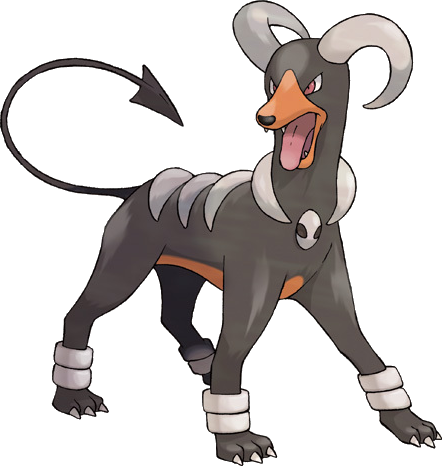

```{r setup, include=FALSE}
knitr::opts_chunk$set(echo = TRUE, message = FALSE,
                      warning = FALSE)
```

## Tree-Based Models

For this assignment, we will continue working with the file `"pokemon.csv"`, found in `/data`. The file is from Kaggle: <https://www.kaggle.com/abcsds/pokemon>.

The [Pokémon](https://www.pokemon.com/us/) franchise encompasses video games, TV shows, movies, books, and a card game. This data set was drawn from the video game series and contains statistics about 721 Pokémon, or "pocket monsters." In Pokémon games, the user plays as a trainer who collects, trades, and battles Pokémon to (a) collect all the Pokémon and (b) become the champion Pokémon trainer.

Each Pokémon has a [primary type](https://bulbapedia.bulbagarden.net/wiki/Type) (some even have secondary types). Based on their type, a Pokémon is strong against some types, and vulnerable to others. (Think rock, paper, scissors.) A Fire-type Pokémon, for example, is vulnerable to Water-type Pokémon, but strong against Grass-type.

{width="200"}

The goal of this assignment is to build a statistical learning model that can predict the **primary type** of a Pokémon based on its generation, legendary status, and six battle statistics.

**Note: Fitting ensemble tree-based models can take a little while to run. Consider running your models outside of the .Rmd, storing the results, and loading them in your .Rmd to minimize time to knit.**

### Exercise 1

Read in the data and set things up as in Homework 5:

- Use `clean_names()`
- Filter out the rarer Pokémon types
- Convert `type_1` and `legendary` to factors

Do an initial split of the data; you can choose the percentage for splitting. Stratify on the outcome variable.

Fold the training set using *v*-fold cross-validation, with `v = 5`. Stratify on the outcome variable.

Set up a recipe to predict `type_1` with `legendary`, `generation`, `sp_atk`, `attack`, `speed`, `defense`, `hp`, and `sp_def`:

- Dummy-code `legendary` and `generation`;
- Center and scale all predictors.

```{r}
library(tidyverse)
library(tidymodels)
library(janitor)

pokemon <- read_csv("data/Pokemon.csv")
pokemon <- clean_names(pokemon)

pokemon <- pokemon %>% 
  filter(type_1 == "Bug" | type_1 == "Fire" |              
        type_1 == "Grass" | type_1 == "Normal" |
        type_1 == "Water" | type_1 == "Psychic")

pokemon <- pokemon %>% 
  mutate(legendary = as.factor(legendary)) %>% 
  mutate(generation = as.factor(generation)) %>% 
  mutate(type_1 = as.factor(type_1)) 

# split & stratify the data
set.seed(12345)

pokemon_split <- initial_split(pokemon, prop = 0.75,              strata = type_1)
pokemon_train <- training(pokemon_split)
pokemon_test <- testing(pokemon_split)

# 5-fold
pokemon_folds <- vfold_cv(pokemon_train, strata = type_1, v = 5)

#recipe
pokemon_recipe <- recipe(type_1 ~ 
                           legendary + generation +
                           sp_atk + attack + speed + 
                           defense + hp + sp_def, 
                         data = pokemon_train) %>%
  step_dummy(legendary) %>%
  step_dummy(generation) %>% 
  step_center(all_predictors()) %>%
  step_scale(all_predictors())  
```

### Exercise 2

Create a correlation matrix of the training set, using the `corrplot` package. *Note: You can choose how to handle the continuous variables for this plot; justify your decision(s).*

What relationships, if any, do you notice? Do these relationships make sense to you?

```{r}
library(corrplot)

pokemon_train %>% 
  mutate(legendary = as.numeric(legendary)) %>% 
  mutate(generation = as.numeric(generation)) %>% 
  dplyr::select(hp, attack, defense, sp_atk, sp_def, speed, generation, legendary) %>% 
  cor(use = "complete.obs") %>% 
  corrplot(method = "circle")

```
As a continuous variables, I chose `hp`, `attack`, `defense`, `sp_atk`, `sp_def`, `speed`, `generation`, `legendary`. Here, I transformed the format of `legendary` to numeric so that `corrplot` package can appropriately work.

We can observe that `hp`, `attack`, `defense`, `sp_atk`, and `sp_def` are highly correlated. Interestingly, the correlation between `speed` and other ability is less correlated. Legendary pokemons tend to have higher ability in general. `generation` does not have significant correlation with any other predictors.

### Exercise 3

First, set up a decision tree model and workflow. Tune the `cost_complexity` hyperparameter. Use the same levels we used in Lab 7 -- that is, `range = c(-3, -1)`. Specify that the metric we want to optimize is `roc_auc`. 

Print an `autoplot()` of the results. What do you observe? Does a single decision tree perform better with a smaller or larger complexity penalty?

```{r}
library(rpart.plot)
library(vip)
library(randomForest)
library(xgboost)

class_tree_spec <- decision_tree() %>%
  set_engine("rpart") %>% 
  set_mode("classification")

class_tree_wf <- workflow() %>%
  add_model(class_tree_spec %>% set_args(cost_complexity = tune())) %>% 
  add_recipe(pokemon_recipe)

param_grid <- grid_regular(cost_complexity(range = c(-3, -1)), levels = 10)
```

```{r, eval=FALSE}
tune_res <- tune_grid(
  class_tree_wf, 
  resamples = pokemon_folds, 
  grid = param_grid, 
  metrics = metric_set(roc_auc)
)

save(tune_res, class_tree_wf, file = "tree_tune.rda")
```

```{r}
load(file = "tree_tune.rda")
autoplot(tune_res)
```

### Exercise 4

What is the `roc_auc` of your best-performing pruned decision tree on the folds? *Hint: Use `collect_metrics()` and `arrange()`.*

```{r}
pruned_result <- collect_metrics(tune_res) %>% arrange(-mean)

head(pruned_result)
```
Best-performing pruned decision is achieved when `cost_complexity` = 0.0129.

### Exercise 5

Using `rpart.plot`, fit and visualize your best-performing pruned decision tree with the *training* set.

```{r}
best_complexity <- select_best(tune_res)

class_tree_final <- finalize_workflow(class_tree_wf, best_complexity)

class_tree_final_fit <- fit(class_tree_final, data = pokemon_train)

#Plot
class_tree_final_fit %>%
  extract_fit_engine() %>%
  rpart.plot()
```

### Exercise 5

Now set up a random forest model and workflow. Use the `ranger` engine and set `importance = "impurity"`. Tune `mtry`, `trees`, and `min_n`. Using the documentation for `rand_forest()`, explain in your own words what each of these hyperparameters represent.

Create a regular grid with 8 levels each. You can choose plausible ranges for each hyperparameter. Note that `mtry` should not be smaller than 1 or larger than 8. **Explain why not. What type of model would `mtry = 8` represent?**

```{r}
rf_model <- 
  rand_forest(
              min_n = tune(),
              mtry = tune(),
              trees = tune(),
              mode = "classification") %>% 
  set_engine("ranger", importance = "impurity")

rf_workflow <- workflow() %>% 
  add_model(rf_model) %>% 
  add_recipe(pokemon_recipe)

rf_params <- parameters(rf_model) %>% 
  update(mtry = mtry(range= c(1, 8)))

# Define grid
rf_grid <- grid_regular(rf_params, levels = 8)
```
-  `min_n`: Minimum number of sample size in a node that are required for the node to be split further. In other words, if there are less observations than `min_n` in a node, the classification is stopped.
-  `mtry`: Number of predictors that will be chosen at each split. By its construction, `mtry` must be equal or less than the total number of predictors. In this example, number of our predictors is 8. Therefore,`mtry` larger than 8 is not meaningful.
-  `trees`: Number of considered trees.

### Exercise 6

Specify `roc_auc` as a metric. Tune the model and print an `autoplot()` of the results. What do you observe? What values of the hyperparameters seem to yield the best performance?

```{r, eval = FALSE}
rf_tune <- rf_workflow %>% 
  tune_grid(resamples = pokemon_folds, 
    grid = rf_grid, metrics = metric_set(roc_auc))

save(rf_tune, rf_workflow, file = "rf_tune.rda")
```

```{r}
load(file = "rf_tune.rda")
autoplot(rf_tune)
```
### Exercise 7

What is the `roc_auc` of your best-performing random forest model on the folds? *Hint: Use `collect_metrics()` and `arrange()`.*

```{r}
rf_result <- collect_metrics(rf_tune) %>% arrange(-mean)
head(rf_result)
```
The best combination of hyperparameters is `(mtry, trees, min_n) = (3, 1143, 2)`.

### Exercise 8

Create a variable importance plot, using `vip()`, with your best-performing random forest model fit on the *training* set.

Which variables were most useful? Which were least useful? Are these results what you expected, or not?

```{r}
rf_spec <- rand_forest(mtry = 3, trees = 1143,min_n = 2) %>%
  set_engine("randomForest", importance = TRUE) %>%
  set_mode("classification")
  
rf_fit <- fit(rf_spec, type_1 ~ 
              legendary + generation +
              sp_atk + attack + speed + 
              defense + hp + sp_def,
              data = pokemon_train)

vip(rf_fit)
```
`sp_atk` is the most useful predictor, and `generation` is the least useful one. This result is not surprising given that (i) `generation` is not significantly correlated with any other predictors, ans (ii) many psychic pokemons have high `sp_atk` (link: https://www.serebii.net/pokedex-sm/stat/sp-attack.shtml). 

### Exercise 9

Finally, set up a boosted tree model and workflow. Use the `xgboost` engine. Tune `trees`. Create a regular grid with 10 levels; let `trees` range from 10 to 2000. Specify `roc_auc` and again print an `autoplot()` of the results. 

What do you observe?

What is the `roc_auc` of your best-performing boosted tree model on the folds? *Hint: Use `collect_metrics()` and `arrange()`.*

```{r}
bt_model <- boost_tree(mode = "classification",
                       trees = tune()) %>% 
  set_engine("xgboost")

bt_workflow <- workflow() %>% 
  add_model(bt_model) %>% 
  add_recipe(pokemon_recipe)

bt_params <- parameters(bt_model) %>% 
  update(trees = trees(range = c(10,2000)))

# define grid
bt_grid <- grid_regular(bt_params, levels = 10)
```

```{r, eval=FALSE}
bt_tune <- bt_workflow %>% 
  tune_grid(
    resamples = pokemon_folds, 
    grid = bt_grid, metrics = metric_set(roc_auc))

save(bt_tune, bt_workflow, file = "bt_tune.rda")
```

```{r}
load(file = "bt_tune.rda")
autoplot(bt_tune)

bt_result <- collect_metrics(bt_tune) %>% arrange(-mean)
head(bt_result)
```
`roc_auc` significantly increase from the beginning to approximately 1000 trees. However, too many number of trees result in worse perfrmance. The best performance is achived when `trees` =  894.

### Exercise 10

Display a table of the three ROC AUC values for your best-performing pruned tree, random forest, and boosted tree models. Which performed best on the folds? Select the best of the three and use `select_best()`, `finalize_workflow()`, and `fit()` to fit it to the *testing* set. 

Print the AUC value of your best-performing model on the testing set. Print the ROC curves. Finally, create and visualize a confusion matrix heat map.

Which classes was your model most accurate at predicting? Which was it worst at?

```{r}
three_models_res <- bind_cols(pruned_result$mean[1],
                              rf_result$mean[1],
                              bt_result$mean[1])
three_models_res
```
From the above table, we can conclude that random forest performed the best. In the following, I fit the random forest to test data.
```{r}
best_rf_param <- select_best(rf_tune, metric = "roc_auc")

rf_wf_final <- finalize_workflow(rf_workflow, best_rf_param)

rf_final_fit <- fit(rf_wf_final, data = pokemon_train)

augment(rf_final_fit, new_data = pokemon_test) %>%
  roc_curve(truth = type_1, 
            estimate = c(.pred_Bug, .pred_Fire,
                         .pred_Grass, .pred_Normal,
                         .pred_Psychic, .pred_Water)) %>% 
  autoplot()

augment(rf_final_fit, new_data = pokemon_test) %>%
  roc_auc(truth = type_1, 
            estimate = c(.pred_Bug, .pred_Fire,
                         .pred_Grass, .pred_Normal,
                         .pred_Psychic, .pred_Water)) 
augment(rf_final_fit, new_data = pokemon_test) %>%
  conf_mat(truth = type_1, estimate = .pred_class) %>% 
  autoplot(type = "heatmap")
```
The result suggests that `roc_auc` = 0.730 in testing data. Normal type pokemons were predicted most precisely, while Grass type pokemons were worst at its prediction.

## For 231 Students

### Exercise 11

Using the `abalone.txt` data from previous assignments, fit and tune a random forest model to predict `age`. Use stratified cross-validation and select ranges for `mtry`, `min_n`, and `trees`. Present your results. What was the model's RMSE on your testing set?
```{r}
# import data
abalone <- read_csv("data/abalone.csv") %>% 
 mutate(age = rings + 1.5)

# split data
set.seed(1234) # you can use any number you like
abalone_split <- abalone %>% initial_split(strata = age, 
                                           prop = 0.70)
abalone_train <- training(abalone_split)
abalone_test <- testing(abalone_split)

# k-fold CV
abalone_folds <- vfold_cv(abalone_train, strata = age, v = 5)

# recipe
abalone_recipe <- recipe(age ~ . , data = abalone_train) %>% 
  step_rm(rings) %>% 
  step_dummy(all_nominal_predictors()) %>% 
  step_interact(terms = ~ starts_with("type"):shucked_weight +
                  longest_shell:diameter + 
                  shucked_weight:shell_weight) %>% 
  step_normalize(all_predictors())

# model building
rf_model_abalone <- 
  rand_forest(
              min_n = tune(),
              mtry = tune(),
              trees = tune(),
              mode = "regression") %>% 
  set_engine("ranger", importance = "impurity")

rf_workflow_abalone <- workflow() %>% 
  add_model(rf_model_abalone) %>% 
  add_recipe(abalone_recipe)

rf_params_abalone <- parameters(rf_model_abalone) %>% 
  update(mtry = mtry(range= c(1, 8)),
         min_n = min_n(range = c(2,20)),
         trees = trees(range = c(1,400)))

# Define grid
rf_grid_abalone <- grid_regular(rf_params_abalone, levels = 5)
```

```{r, eval=FALSE}
rf_tune_abalone <- rf_workflow_abalone %>% 
  tune_grid(resamples = abalone_folds, 
    grid = rf_grid_abalone, metrics = metric_set(rmse))

save(rf_tune_abalone, rf_workflow_abalone, file = "rf_tune_abalone.rda")
```

The plot of tuning parameter and prediction results:
```{r}
load(file = "rf_tune_abalone.rda")
autoplot(rf_tune_abalone)
```

```{r}
best_rf_param_abalone <- select_best(rf_tune_abalone, metric = "rmse")

rf_wf_final_abalone <- finalize_workflow(rf_workflow_abalone, best_rf_param_abalone)

rf_final_fit_abalone <- fit(rf_wf_final_abalone, data = abalone_train)

augment(rf_final_fit_abalone, new_data = abalone_test) %>%
  rmse(truth = age, estimate = .pred)
```
RMSE for testing data is equal to 2.170.

Finally, I create a quick scatter plot between `age` and its predicted value.
```{r}
augment(rf_final_fit_abalone, new_data = abalone_test) %>%
  ggplot(aes(age, .pred)) +
  geom_abline() +
  geom_point(alpha = 0.5)

```